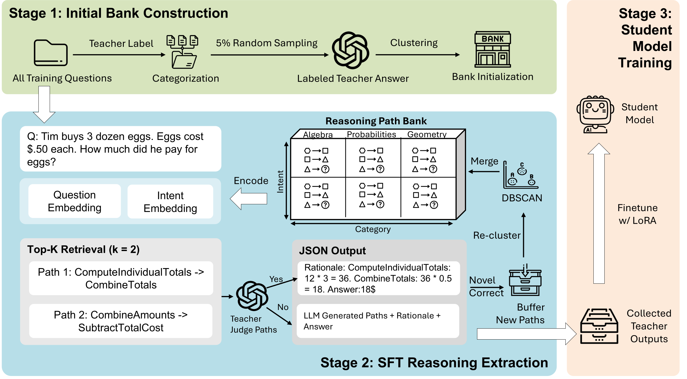

<div align="center">

# D-RPC

### Structural Rationale Distillation via Reasoning Space Compression

[](https://arxiv.org/abs/2605.07139)
[](LICENSE)
[](pyproject.toml)
[](requirements.txt)
[](https://neurips.cc/)

Code, teacher data, student predictions and supplementary experiments for our NeurIPS 2026 paper.

</div>

---

## Overview

Rationale distillation trains a small student on the explanations of a large teacher. Free-form
explanations are expensive to imitate: every question gets its own way of reasoning, so the student
has to learn an unbounded space of rationales. **D-RPC** (Distillation through a Reasoning-Path
Bank) compresses that space first. The teacher's reasoning is distilled into a bank of named
reasoning paths organised by category and intent; each training question is routed to the bank and
the teacher writes a structured, step-keyed rationale along the retrieved path; the student is
fine-tuned on those structured rationales with LoRA. Because the paths are shared across questions,
the student learns a small, reusable set of reasoning schemas instead of thousands of one-off
explanations.

<p align="center">
  
</p>

All methods in Table 1 share one student recipe (LoRA r=64, alpha=128, lr 1e-4, batch 2 x 8,
2 epochs, seed 42, greedy decoding, 2048 new tokens). The scorer and baseline-specific exceptions
are documented with the released predictions.

## Main results

Accuracy (%) on the test sets, mean ± sample standard deviation over 10 LoRA runs (Table 1 of the
paper). The values below are the paper-reported results. Released predictions and their provenance
are documented in [`predictions/table1/`](predictions/table1/README.md).

Some original experiment artifacts were removed during cluster cleanup. The affected experiments
were rerun with the same configuration, and the released artifacts include these replacement runs.
The reruns retain the overall performance trend reported in the paper, while individual means and
standard deviations can differ. The paper-reported values remain the reference for the tables below.
The [verification report](predictions/table1/paper_table_verification.csv) records paper values and
available-artifact statistics separately.

**Llama-3.1-8B-Instruct**

| dataset | CoT | Freeform | SuperCorrect | DCoT | SGFT | **D-RPC** |
|---|---|---|---|---|---|---|
| GSM8K | 83.96 ± 0.33 | 81.63 ± 0.72 | 82.42 ± 0.46 | 81.86 ± 0.64 | 77.94 ± 0.69 | **85.41 ± 0.49** |
| AQUA | 64.02 ± 0.77 | 60.39 ± 1.61 | 59.45 ± 2.59 | 61.81 ± 2.43 | 60.16 ± 2.67 | **67.52 ± 1.59** |
| StrategyQA | 73.32 ± 1.31 | 72.27 ± 1.27 | – | 72.53 ± 1.81 | 70.31 ± 1.29 | **74.15 ± 1.49** |
| AI2ARC | 87.92 ± 0.29 | 92.41 ± 0.34 | – | 80.78 ± 12.38 | 86.71 ± 0.76 | **92.92 ± 0.34** |
| MATH | 41.57 ± 0.35 | 41.68 ± 0.18 | 36.62 ± 0.46 | 45.23 ± 0.53 | 36.15 ± 0.43 | **48.76 ± 0.45** |

**Qwen3-1.7B**

| dataset | CoT | Freeform | SuperCorrect | DCoT | SGFT | **D-RPC** |
|---|---|---|---|---|---|---|
| GSM8K | 77.92 ± 0.29 | 73.38 ± 0.68 | 76.44 ± 0.58 | 73.99 ± 0.69 | 65.44 ± 0.59 | **78.29 ± 0.95** |
| AQUA | 59.92 ± 0.89 | 62.99 ± 0.83 | 63.78 ± 2.59 | 59.65 ± 1.37 | 49.06 ± 10.60 | **74.76 ± 1.84** |
| StrategyQA | 61.92 ± 0.92 | 61.75 ± 2.29 | – | **66.16 ± 1.39** | 60.26 ± 2.78 | 64.59 ± 2.46 |
| AI2ARC | 88.78 ± 0.40 | 88.70 ± 0.30 | – | 85.74 ± 2.90 | 75.99 ± 0.18 | **88.82 ± 0.54** |
| MATH | 49.21 ± 0.40 | 48.09 ± 0.26 | 42.82 ± 0.36 | 54.91 ± 0.34 | 29.44 ± 0.29 | **59.72 ± 0.39** |

`python -m drpc.eval.summarize_table1` summarizes the released predictions.
[`predictions/table1/summary.md`](predictions/table1/summary.md) reports statistics from those files,
and [`paper_table_verification.csv`](predictions/table1/paper_table_verification.csv) provides the
per-cell comparison with the paper, including the documented baseline-specific scoring rules.

The bound-component diagnostic uses LoRA ranks r=128 for Llama-3.1-8B-Instruct and r=64
for Qwen3-1.7B. Table 1 uses r=64 for both students and reports ten-run means.

## Repository layout

```
drpc/
  teacher/      prompts; round-1 and bank-conditioned round-2 teacher queries; direct prompting of local models
  bank/         reasoning-path bank construction, routing, de-duplication, incremental updates
  student/      LoRA / full fine-tuning of the student and greedy generation on the test sets
  eval/         answer extraction and accuracy (eval_json_accuracy.py), Table-1 summary, pass@k
baselines/      SGFT (self-contained) and a pointer to our DCoT fork
scripts/        launch templates for every stage (SLURM scripts assume one GPU)
data/           the five benchmarks and all teacher data (gzip)            -> data/README.md
predictions/    per-question student outputs behind Table 1 (git LFS)      -> predictions/table1/README.md
supplementary/  reasoning-path bank ablation: arm data, predictions, results -> supplementary/bank_ablation/README.md
tests/          tests of the scorer
```

## Installation

```bash
git clone git@github.com:Marvelrex/D-RPC.git && cd D-RPC
python -m venv .venv && source .venv/bin/activate
pip install -e .                       # or: pip install -r requirements.txt
git lfs install && git lfs pull        # prediction files only (about 830 MB)
bash scripts/unpack_data.sh            # decompresses the teacher data in place
export OPENAI_API_KEY=...              # teacher stages only
```

The paper runs used Python 3.11, torch 2.9.0, transformers 4.57.1 and peft 0.18.0 on one H100.
The students are `meta-llama/Llama-3.1-8B-Instruct` (gated on Hugging Face) and `Qwen/Qwen3-1.7B`.
All commands below run from the repository root.

## Reproducing the pipeline

The stages follow the figure above. The released teacher data lets you start at stage 3; stages 1
and 2 regenerate it with your own teacher.

**Stage 1 - initial bank construction.** The teacher labels the training questions with the chosen
strategy and writes `results_<strategy>.jsonl`; for `rpb` each reply carries a route (category,
intent, difficulty, budget, a reasoning path of TitleCase step names), a step-keyed rationale and
the answer. `drpc/bank/build_taxonomy.py` then keeps the correct rationales of a random sample,
embeds their intents (`all-MiniLM-L6-v2`), reduces them with PCA and clusters them with DBSCAN
inside each category. The bank is `{category: {intent: [reasoning paths]}}`;
`filter_taxonomy_similar.py` removes near-duplicate paths.

```bash
STRATEGY=rpb DATASET_NAME=gsm8k DATASET_PATH=data/GSM8K/train.jsonl bash scripts/teacher_round1.sh
RESULTS=outputs/teacher/gsm8k/round1/results_rpb.jsonl bash scripts/build_bank.sh
```

**Stage 2 - SFT reasoning extraction.** `drpc/teacher/run_second_round_batch.py`
routes every training question to the bank, asks the teacher to follow the retrieved path or refine
it conservatively, records whether the final path came from the bank, and grows the bank with new
routes (re-clustering every `--threshold` routes). Its output is the student training file
(`data/<DATASET>/teacher/rpb_second_round.json` in this release).

```bash
QUESTIONS=data/GSM8K/train.jsonl BANK=data/reasoning_bank/taxonomy.json bash scripts/teacher_round2.sh
```

**Stage 3 - student training and evaluation.** One submission trains one student on one
teacher file and generates greedy predictions on the test set; the same script serves every
strategy, and `run_distill_experiments.py` refuses to train a strategy whose hyperparameters differ
from the recorded signature. A Table-1 cell is the mean of 10 submissions with `RUN=1..10`.

```bash
STRATEGY=rpb DATA_FILE=data/GSM8K/teacher/rpb_second_round.json TRAIN_SIZE=10000 \
TEST_FILE=data/GSM8K/test.jsonl MODEL=Qwen/Qwen3-1.7B RUN=1 VENV_ACTIVATE=.venv/bin/activate \
sbatch scripts/train_student.slurm

python drpc/eval/eval_json_accuracy.py outputs/students/GSM8K_rpb/Qwen3-1.7B/Run1/pred/<file>.jsonl --format-validity
```

| method | teacher output | launcher |
|---|---|---|
| D-RPC | route + step-keyed rationale + answer, conditioned on the retrieved path | `scripts/train_student.slurm` |
| Freeform | the same JSON target without any route or path | `scripts/train_student.slurm` |
| CoT | step-by-step rationale and answer | `scripts/train_student.slurm` |
| SuperCorrect ([original](https://github.com/YangLing0818/SuperCorrect-llm)) | step / key / generalisation / answer tags | `scripts/train_student.slurm` |
| SGFT ([original](https://github.com/BiJings/SGFT)) | solution guidance, then the answer | `scripts/sgft_lora.slurm`, `baselines/sgft/` |
| DCoT ([original](https://github.com/UKPLab/acl2025-diverse-cot)) | divergent chains of thought; trained and evaluated with the official implementation | `baselines/dcot/README.md` |
| direct prompting | the un-tuned base model with the method's prompt, no training | `scripts/direct_prompt.slurm` |

The training script selects the method with `STRATEGY` (`rpb`, `freeform`, `cot`, `super_correct`, `sgft`).

[`baselines/README.md`](baselines/README.md) states, for every baseline, whether the original
implementation or our re-implementation was used.

## Compute requirements

All student runs were executed on NVIDIA H100 80GB GPUs partitioned into MIG slices
(`3g.40gb`: 40 GB of GPU memory, with 8 CPU cores and 40 GB of RAM per job). LoRA training of
Llama-3.1-8B-Instruct (bf16, gradient checkpointing, batch 2, sequences up to 2048 tokens) fits in
the 40 GB slice; Qwen3-1.7B generation also runs on a `2g.20gb` slice. A full H100 is several times
faster than a slice for the same job. Generation is greedy at batch size 1 with at most 2048 new
tokens, which dominates the wall-clock time on the large test sets.

Measured wall-clock time per run (LoRA training on 10,000 teacher examples for 2 epochs, then
generation on the full test set), from the SLURM accounting of the bank-ablation campaigns on
`3g.40gb` slices:

| dataset | Llama-3.1-8B-Instruct | Qwen3-1.7B | of which training |
|---|---|---|---|
| AQUA | 2.3 h (1.9-2.6) | 1.7 h (1.3-1.9) | about 1.3-2 h |
| MATH | 31 h (21-33) | 30 h (19-32), partly on `2g.20gb` | about 1.5-2 h |

MATH generation takes about 20 s per question at batch size 1 because its outputs are long
(1,800 characters on average, 10% reaching the 2048-token cap); jobs are chained with checkpoint
and prediction resumption (`scripts/train_student.slurm` resumes a partially generated run). GSM8K,
AI2ARC and StrategyQA have shorter outputs and complete in roughly 2-4 h per run. The 160 runs of the multi-seed ablation campaign used 2,484 slice-hours in total; the 560 runs
behind Table 1 plus the 320 ablation runs amount to roughly 10,000 slice-hours, most of it MATH
generation.

Teacher generation uses the OpenAI API (`gpt-5.1`): one request per training question and round
(10,000 requests per dataset and strategy for round 2, plus the round-1 and category/intent
annotation requests); the SGFT solution guidance was generated with `gpt-5.2`.

## Data

`data/` contains the train and test files of GSM8K, AQUA, StrategyQA, AI2ARC and MATH and the
teacher data of every method; `data/manifest.csv` lists row counts and md5 sums. The D-RPC teacher
file stores, for each training question, the route given to the teacher, the retrieved reasoning
path, the structured rationale, the teacher's answer and whether it matched the reference.
See [`data/README.md`](data/README.md) for the schemas.

## Supplementary: reasoning-path bank ablation

Does the content of the retrieved path matter? [`supplementary/bank_ablation/`](supplementary/bank_ablation/README.md)
replaces the retrieved path with nothing (`empty`), with a path from an unrelated bank slot
(`random`) or with a uniform draw from the whole bank (`randglobal`), and separately drops the
teacher-incorrect items (`filtered`), on MATH and AQUA. It ships the arm data, the predictions of
10 runs per cell under the paper protocol and a multi-seed robustness check on AQUA, the result
tables with confidence intervals, the path reuse and entropy statistics, and the scripts that
rebuild all of them.

## Tests

```bash
python -m pytest tests baselines/sgft/tests
```

## Citation

```bibtex
@inproceedings{yang2026drpc,
  title     = {Structural Rationale Distillation via Reasoning Space Compression},
  author    = {Yang, Jialin and Wang, Jiankun and Wu, Jiajun and Leung, Henry and Zhou, Jiayu and Drew, Steve},
  booktitle = {The Fortieth Annual Conference on Neural Information Processing Systems (NeurIPS 2026)},
  year      = {2026},
  note      = {arXiv:2605.07139}
}
```

## License

This repository is released under the MIT License (see [`LICENSE`](LICENSE)). The benchmark
datasets keep their original licenses.
